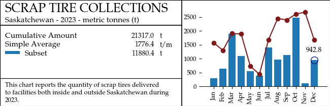

# KPI Charts
The `kpi` tool is a way of creating wide-aspect annotated charts for communicating study 
information.  The tool uses `matplotlib` for flexible layout and saves charts to static files
for inclusion on webpages or reports.

The charts are built by specifying geometric / layout parameters at initialization, then layering
on datasets and annotations, and finally saving the finished plot.

The strategy is to produce and save static plots, and `matplotlib` is not ideal for responsive
(i.e. WYSIWYG) design, so the workflow is to adjust parameters and re-run the chart until it 
meets your desired appearance.

## Quickstart / Example

```python
from antelope_reports import kpi
import datetime
from random import random

xs = [1568, 1299, 1908, 1888, 726, 435, 1685, 2450, 2396, 2610, 2676, 1676]
labels = [datetime.date(2024, i, 1).strftime('%b') for i in range(1,13)]

sv = kpi.ExtensiveKpi('SCRAP TIRE COLLECTIONS', 'Saskatchewan - 2023 - metric tonnes', 't', 
                      figsize=(6.5,2.1), fontsize=11)
sv.set_comment("This chart reports the quantity of scrap tires delivered to facilities\
both inside and outside Saskatchewan during 2023.")
sv.draw_plot(labels, xs, label='Tire Collections', this=None)
sv.report_total()
sv.report_average(unit='t/m')

x2 = [x*random() for x in xs]
sv.draw_barplot(labels, x2, label="Subset")
sv.report_total("Subset", draw_symbol=True)
sv.chart.tick_params(axis='x', rotation=90)
sv.save('foo.png')
```



# Usage

The KPI has the following layout (dimensions indicate layout parameters during init):
```text
           |   --  --  --  --  --   figsize  (inches)  --  --  --  --  --  --   |
           |   - - - - text_f (0.55) - - - -   |
           |  - - - - metrics - - - - - |-|
   ----    +====================================================================+   ---
    |      |TITLE                              |                                |
title_in   |subtitle (unit)                    |                                |
  ----     |-----------------------------------|              chart             |
           | (metric)             NUMBER  unit |                                |  figsize(inches)
           | (...)                (...)        |                                |
           |                                   |                                |
  ______   |___________________________________|                                |
comment_in |comment                            |                                |
  ------   +====================================================================+   ---

```

If `long=True` is specified, then the chart takes on the following form:
```text
    +--------------------------------------------------------------------+
    |TITLE                              |                                |
    |subtitle (unit)                    |                                |
    |-----------------------------------|              chart             |
    | (metric)             NUMBER  unit |                                |
    | (...)                (...)        |                                |
    |                                   |                                |
    |___________________________________|________________________________|
    |long comment ....                                                   |
    |                                                                    |
    +--------------------------------------------------------------------+
```

## Initialization

The chart's geometry is meant to be defined at initialization.  This is because geometric 
parameters supplied by the user are used to position content in the plotting region, and
repositioning those elements dynamically seemed inconvenient.  

```python
class KpiBase:
    def __init__(self, title, subtitle, unit, comment=None, long=False, fontsize=12, 
                 figsize=(6.5, 1.8), title_in=0.5, comment_in=0.45, 
                 text_f=0.55, metrics=(0.85, 0.88), 
                 frame_lw=1.2, graph_l_m_in=0.36, graph_b_m_in=0.35):
        self._xs = [] 
        ...

```
 - **title**: Appears in uppercase letters at a size of `1.6*fontsize`
 - **subtitle**: appears directly below the title in `fontsize`
 - **unit** used to annotate data reports and also printed on the subtitle
 - **comment** General annotation of the plot, appears in the bottom box
 - **long** (default False) if True, the comment space is extended below the chart
 - **fontsize**: (12) determines all font sizes on the chart (title is `fontsize * 1.6`, axes 
annotations are `fontsize * 0.83`)

### Frame Layout Parameters

 - **figsize**: (6.5, 1.8) standard `matplotlib` figsize in inches
 - **title_in**: (0.5) height of the title region in inches
 - **comment_in**: (0.45) height of the comment region in inches
 - **text_f**: (0.55) what fraction of the plot width is used for the text box
 - **metrics**: (0.85, 0.88) specifies the fraction *of* the text width where the NUMBER 
(right-align) and unit (left-align) of metrics are placed
 - **frame_lw**: (1.2) frame linewidth

### Graph Layout Parameters

 - **graph_l_m_in**: (0.36) margin between chart region and graph left edge in inches
 - **graph_b_m_in**: (0.35) margin between chart region and graph bottom edge in inches

## Adding Content

### Adding data series

You add a data series with the `draw_plot()` or `draw_barplot()` functions. Multiple data
series can be added in turn, with annotation commands always referring to the most recently 
added series.

```python
class KpiBase:
    ...
    def draw_plot(self, xs, ys, linestyle='-', marker='o', color=(0.5, 0.1, 0.1), g_gap=0.38, fill=None,
                  **kwargs):
        pass

```
The core is the `xs` and `ys`, data values to be plotted.  The `marker` and `color`, along with `**kwargs`,
are all passed to the plotting function.  

`fill` designates that the region between the current and a prior plot be filled in using the color 
at 30% opacity.  The `fill` argument can either be `True`, which will cause a fill between the 
current plot and the x axis, or an integer, which will cause a fill between the current plot and
the indicated plot series.

`g_gap` is a formatting control that adjusts the x axis outward by the designated amount. It
is passed to the `rescale()` function.

```python
class KpiBase:
    ...
    def draw_barplot(self, xs, ys, color=(0.121, 0.467, 0.706), g_gap=0.38, **kwargs):
        pass
```
Draws a barchart instead of a line chart. Coming soon: Stack-bar!

### Adding Annotations
After data have been added to the chart on the right, a number of methods can be used to add
KPI metrics on the left.  Each metric takes the form:

```text
|metric        AMOUNT units |
```
where the values are automatically derived if not specified.

```python
class KpiBase:
    ...
    def report_total(self, metric=None, weight=None, **kwargs):
        # report the cumulative total of the data series
        pass
    
    def report_average(self, metric=None, weight=None, **kwargs):
        # report the average of the data series
        pass
    
    def report_value(self, ix=None, draw_label=None, **kwargs):
        # report a literal value by index
        pass

    def report_change(self, ix, pct=True, **kwargs):
        # report change from the designated index to the final value
        pass

    def report_literal(self, metric, amount, unit, **kwargs):
        # report a value not derived from the data
        pass
```
Each of these can admit the following arguments:
 - **unit**: overrides the chart's default unit, or the literal string 'none' to suppress it
 - **fmt**: format for numerical report
 - **draw_symbol**: whether to produce a legend symbol derived from the current plot
 - **record_args**: passed to record text
 - **amount_args**: passed to amount text
